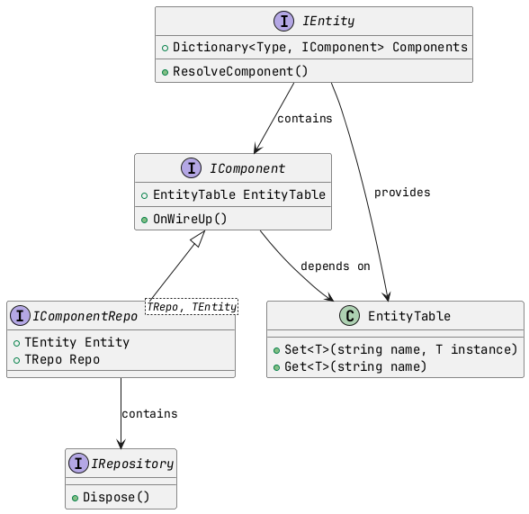

# Flappy Bird ECS

## Kiến trúc

- Kiến trúc dựa trên ECS, MVVM và DDD làm cốt lõi

### Các thành phần cốt lõi

- **Entity**: Đóng vai trò là container chứa các component
- **Component**: Cung cấp chức năng cụ thể cho entity
- **Repository**: Quản lý trạng thái của component
- **EntityTable**: Đăng ký trung tâm cho tất cả entity
- **StateMachine**: Quản lý trạng thái của entity

### Vòng đời

1. Entity đăng ký vào EntityTable
2. Entity tìm kiếm và khởi tạo các component
3. Component thiết lập kết nối và đăng ký sự kiện
4. Component có thể đăng ký với state machine

### Ưu điểm

- **Tính mô-đun hóa**: Component có thể tái sử dụng
- **Kết nối lỏng lẻo**: Component phụ thuộc vào giao diện
- **Khả năng mở rộng**: Dễ dàng thêm loại component mới
- **Khả năng kiểm thử**: Dễ dàng tạo mock cho testing
- **Phân tách rõ ràng**: Repository tách biệt trạng thái và hành vi

## Phân tích nghiệp vụ

- Use case

  [Usecase](usecase.jpg)

- Sequence

  [Sequence](sequence.jpg)
